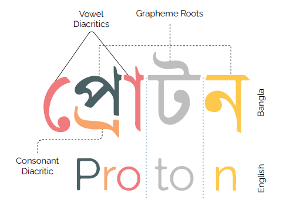

# Bengali Grapheme Classifier App

An application to classify handwritten Bengali graphemes.


[Source](https://arxiv.org/abs/2010.00170)

Interact with the [streamlit application here](https://share.streamlit.io/kmjawadurrahman/bengali-grapheme-classifier-app/main/app.py).

App preview:


## Table of contents
- [Dataset](#dataset)
- [Model](#model)
- [Project Structure](#project-structure)
- [Setup and Installation](#setup-and-installation)
- [Usage](#usage)


## Dataset

The dataset is introduced in this paper: [A Large Multi-Target Dataset of Common Bengali Handwritten Graphemes](https://arxiv.org/abs/2010.00170).

The dataset is open-sourced as a part of a public Handwritten Grapheme Classification Challenge on Kaggle to benchmark vision algorithms for multi-target grapheme classification.

Link to Kaggle page: [Bengali.AI Handwritten Grapheme Classification](https://www.kaggle.com/c/bengaliai-cv19/overview)

You can read the [paper summary here](https://github.com/kmjawadurrahman/bengali-grapheme-classifier-app/blob/main/docs/Grapheme-paper-review.pdf).


## Model

A simple Convolutional Neural Network model has been used. The training code is mostly based on this [Kaggle kernel](https://www.kaggle.com/ngminhton/bengali-graphemes-starter-eda-multi-output-cnn) with minor tweaks.


## Project Structure

│   .gitignore
│   app.py
│   packages.txt
│   README.md
│   requirements-dev.txt
│   requirements.txt
│
├───assets
│       app-preview.gif
│       grapheme-components.png
│       header.png
│
├───docs
│       Grapheme-paper-review.docx
│       Grapheme-paper-review.pdf
│
├───input
│   │   class_map.csv
│   │
│   ├───bengaliai-cv19
│   │       class_map.csv
│   │       class_map_corrected.csv
│   │       sample_submission.csv
│   │       test.csv
│   │       test_image_data_0.parquet
│   │       test_image_data_1.parquet
│   │       test_image_data_2.parquet
│   │       test_image_data_3.parquet
│   │       train.csv
│   │       train_image_data_0.parquet
│   │       train_image_data_1.parquet
│   │       train_image_data_2.parquet
│   │       train_image_data_3.parquet
│   │       train_multi_diacritics.csv
│   │
│   ├───kalpurush-fonts
│   │       kalpurush-2.ttf
│   ├───sample-images
│   └───upload-images
├───model
│   │   model.png
│   │
│   └───my_model
│       │   saved_model.pb
│       │
│       └───variables
└───notebooks
    └───Bengali Graphemes Multi Output CNN.ipynb

`app.py` - The streamlit app code, including input image preparation and inference logic.
`packages.txt` - List of OS level dependencies. Required for deploying app via share.streamlit.io.
`requirements-dev.txt` - List of required Python packages for dev environment (for training model using Jupyter and running streamlit app locally).
`requirements.txt` - List of Python packages required for deploying app via share.streamlit.io.
`docs` - Folder containing paper summary document.
`input/class_map.csv` - Maps the class labels to the actual Bengali grapheme components.
`input/bengaliai-cv19` **(gitignored)** - Data files obtained from Kaggle. See [Setup and Installation](#setup-and-installation).
`input/sample-images` - Sample images used by the streamlit app when input mode is set to "Use provided images".
`input/upload-images` - Some samples of my own handwriting that you can upload when input mode is set to "Upload own character images".
`model` - Folder containing saved model and an image of the model architecture.
`notebooks` - Folder containing the Jupyter Notebook for model training.

## Setup and Installation

Prerequisite: Python 3.7

Install required packages in a Python virtual environment:
```bash
$ pip install -r requirements-dev.txt
```

Next, to obtain the data from Kaggle, set up [official Kaggle API from here](https://github.com/Kaggle/kaggle-api).

After setting up the official Kaggle API, open terminal and run:
```bash
$ kaggle competitions download -c bengaliai-cv19
```

Unzip the downloaded file and arrange the data in the `input` folder as shown in the [Project Structure](#project-structure) section.


## Usage

To explore the dataset or train the model, run the Jupyter Notebook - `notebooks/Bengali Graphemes Multi Output CNN.ipynb`

To run the streamlit app using the provided pre-trained model, run:
```bash
$ streamlit run app.py
```


https://share.streamlit.io/kmjawadurrahman/bengali-grapheme-classifier-app/main/app.py

### Readme to be updated soon